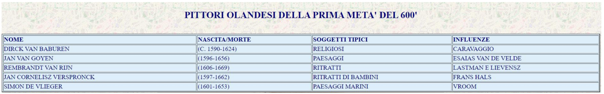
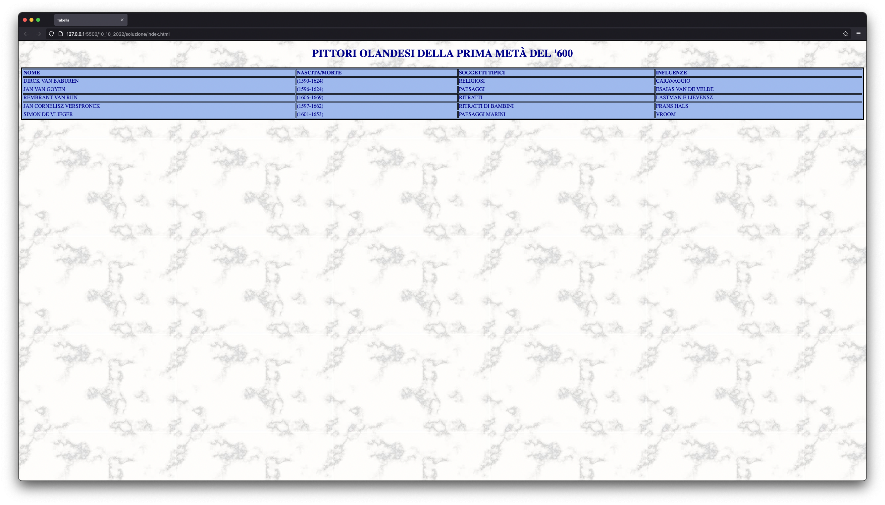

# Tabella base

In questo esercizio impariamo a creare una tabella standard e modificare qualche parametro visivo della pagina.

## Consegna

Copiare questa situazione:

## Risultato tramite la soluzione riportata

---

### Analisi della struttura

Ho creato una struttura di cartelle molto semplice:

- Un'index in HTML e il proprio foglio di stile CSS nella cartella madre.
- Una sottocartella "assets" in cui ho inserito l'immagine di sfondo della pagina.
