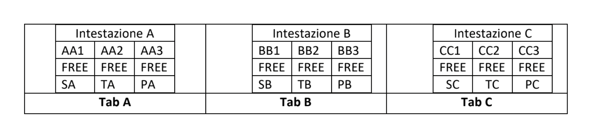
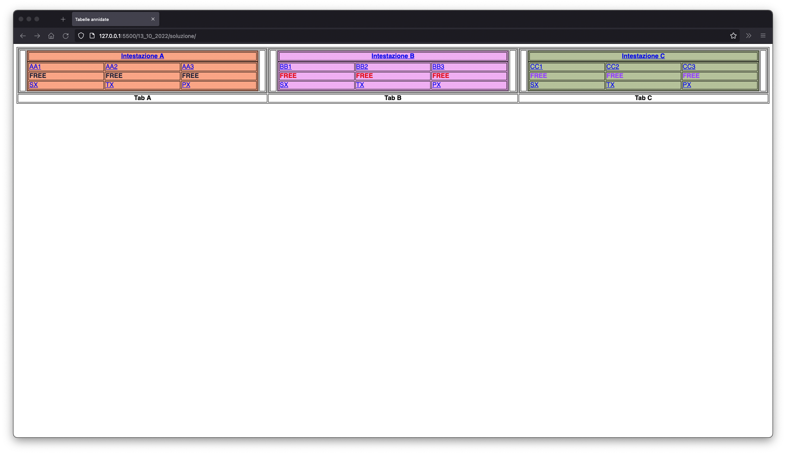
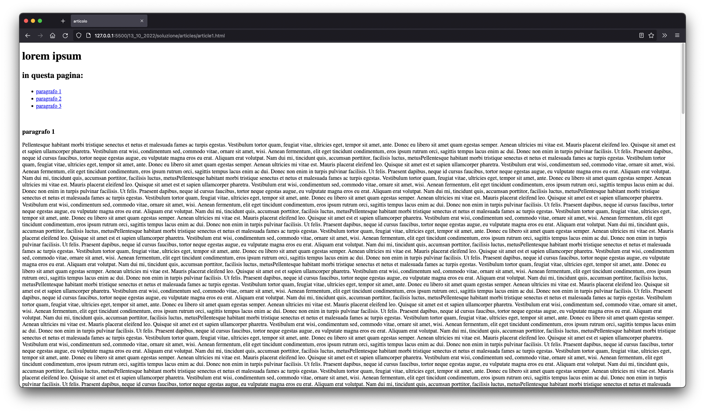
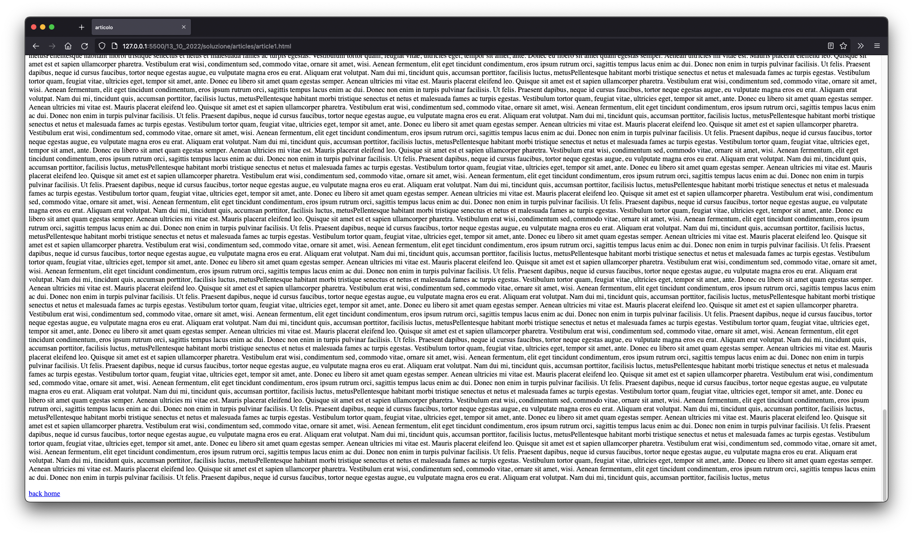

# Tabelle complesse

In questo esercizio impariamo a sfruttare alcuni attributi delle tabelle e sfruttate hyperlinks per la navigazione delle pagine.

## Consegna

just _"copypasted"_

-Strutturata per tabelle, ossia dovrà contenere 3 tabelle da 12 elementi cadauno.

>

-Ogni tabella dovrà essere realizzata con un colore di fondo (a piacere) ma distinto.

-Ogni intestazione dovrà condurre a una nuove pagina che dovrà contenere la sezione di un libro
costituito da 3 paragrafi (§1, §2, §3) liberamente raggiungibili all’interno della pagina da opportuni
iper-link, infine ogni pagina dovrà prevedere un link per il “go back” alla pagina main.

-Ogni tabella dovrà consentire nella prima riga la possibilità di inviare una e-mail rispettivamente
agli indirizzi AA1 ... AA3; BB1...BB3; CC1...CC3.

-Le rimanenti righe delle tabelle dovranno contenere la parola FREE scritta in ogni tabella con un
colore diverso con un font a piacere delle medesime dimensioni in BOLD TYPE.

Le rimanenti righe delle tabelle che conterranno le stringhe SX, TX, PX dovranno consentire il
raggiungimento di siti web (esterni) a piacere ma distinti per ogni elemento di ogni tabella.

## Risultato tramite la soluzione riportata

index.html
>

article1.html/article2.html/article3.html
>

---

### Analisi della struttura

Ho creato una struttura di cartelle molto semplice:

- Un'index in HTML e il proprio foglio di stile CSS nella cartella madre.
- Una sottocartella "articles" in cui ho inserito i tre "articoli" richiesti
